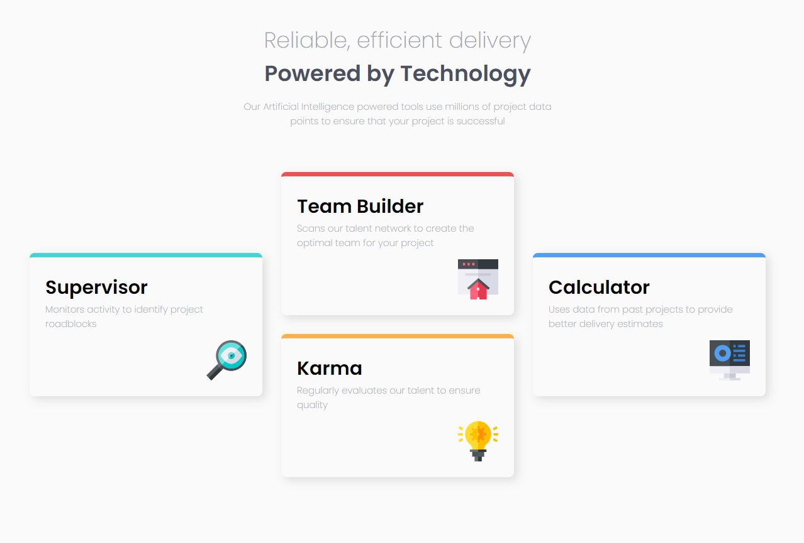

<div align="center">
 <a href="#rocket-frontend-mentor-four-card">Project</a> •
 <a href="#camera-screenshot">Screenshot</a> •
 <a href="#globe_with_meridians-links">Links</a> •
 <a href="#hammer_and_wrench-technologies">Technologies</a> •
 <a href="#books-what-i-learned">Learned</a> •
 <a href="#arrow_forward-run">Run</a> •
 <a href="#boy-author">Author</a>
 </div>

## :rocket: **Frontend Mentor - Four card**

This is a solution to the [Four card feature section challenge on Frontend Mentor](https://www.frontendmentor.io/challenges/four-card-feature-section-weK1eFYK). Frontend Mentor challenges help you improve your coding skills by building realistic projects. 

## :camera: **Screenshot**





## :globe_with_meridians: **Links**

- Solution URL: [Four-Card](https://fourcard.herokuapp.com/)

## :hammer_and_wrench: **Technologies**

- Html5
- Flexbox
- [Sass](https://sass-lang.com/) - CSS Preprocessor 
- [React](https://reactjs.org/) - JS library
- [Styled Components](https://styled-components.com/) - For styles

## :books: **What I learned**

Learned how to pass content to a component.I also applied Sass to the site.

```js
<Card title={"card1"}>
    <h1>Supervisor</h1>
    <p>Monitors activity to identify project roadblocks</p>
    
</Card>
```

```js
export function Card({title, children}){
  return(
    <div className={title}>
      {children}
    </div>
  )
}
```

## :arrow_forward: **Run**

To run the project you need to clone or download this repository, have the Node Package Manager (NPM) or the YARN Package Manager installed (YARN).

```bash
$ git clone https://github.com/evertonvargas/Project.git
$ cd letmeask
```

Follow the steps below:
```bash
# Install the dependencies
$ yarn

# Start the project
$ yarn start
```
The app will be available for access on your browser at http://localhost:3000
## :boy: **Author**

<a href="https://github.com/evertonvargas">
  
</a>
<br />
<a href="https://www.linkedin.com/in/everton-vargas/" target="_blank"></a><br/>


